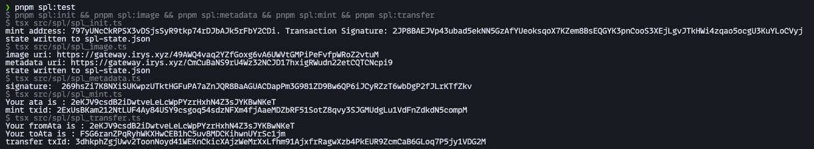
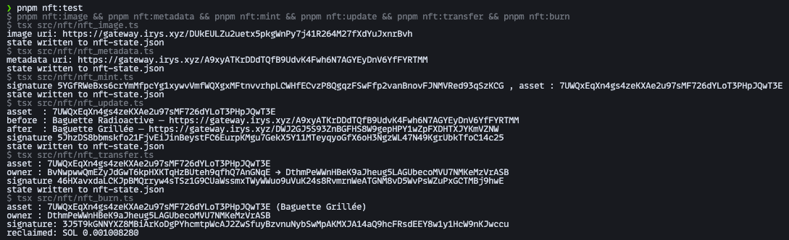

# Baguette – SPL Token & MPL Core NFT

Solana learning project built as part of the [Turbin3](https://turbin3.org/) Q3 2026 Builders cohort.
Everything below runs on **devnet**.

## Token information

| Item | Value |
|---|---|
| Cluster | devnet |
| Name | Baguette |
| Symbol | BGT |
| Mint | [797yUNcCkRPSX3vDSjsSyR9tkp74rDJbAJk5rFbY2CDi](https://explorer.solana.com/address/797yUNcCkRPSX3vDSjsSyR9tkp74rDJbAJk5rFbY2CDi?cluster=devnet) |
| Metadata account | [6kj583GVGtAKy2k3RMZPfAxHw7bymBhjev3vfonqhfvL](https://explorer.solana.com/address/6kj583GVGtAKy2k3RMZPfAxHw7bymBhjev3vfonqhfvL?cluster=devnet) |
| Mint & update authority | [BvNwpwwQmEZyJdGwT6kpHXKTqHzBUteh9qfhQ7AnGNqE](https://explorer.solana.com/address/BvNwpwwQmEZyJdGwT6kpHXKTqHzBUteh9qfhQ7AnGNqE?cluster=devnet) |
| Freeze authority | none |
| Decimals | `6` |
| Supply | `1 BGT` (1,000,000 base units) |

### Balances after the run

| Holder | Associated token account | Balance |
|---|---|---|
| Creator [BvNw…GNqE](https://explorer.solana.com/address/BvNwpwwQmEZyJdGwT6kpHXKTqHzBUteh9qfhQ7AnGNqE?cluster=devnet) | [2eKJV9csdB2iDwtveLeLcWpPYzrHxhN4Z3sJYKBwNKeT](https://explorer.solana.com/address/2eKJV9csdB2iDwtveLeLcWpPYzrHxhN4Z3sJYKBwNKeT?cluster=devnet) | `0.999 BGT` |
| Recipient [Dthm…rASB](https://explorer.solana.com/address/DthmPeWWnHBeK9aJheug5LAGUbecoMVU7NMKeMzVrASB?cluster=devnet) | [FSG6ranZPqRyhWKXHwCEB1hC5uv8MDCKihwnUYrSc1jm](https://explorer.solana.com/address/FSG6ranZPqRyhWKXHwCEB1hC5uv8MDCKihwnUYrSc1jm?cluster=devnet) | `0.001 BGT` |

### SPL transactions

| Step | Script | Link |
|---|---|---|
| 1. Mint account creation | `spl:init` | [2JP8B…oCVyj](https://explorer.solana.com/tx/2JP8BAEJVp43ubad5ekNN5GzAfYUeoksqoX7KZem8BsEQGYK3pnCooS3XEjLgvJTkHWi4zqao5ocgU3KuYLoCVyj?cluster=devnet) |
| 2. Image and metadata upload | `spl:image` | [image](https://gateway.irys.xyz/49AWQ4vaq2YZfGoxg6vA6UWVtGMPiPeFvfpWRoZ2vtuM) · [metadata JSON](https://gateway.irys.xyz/CmCuBaNS9rU4Wz32NCJD17hxigRWudn22etCQTCNcpi9) |
| 3. Metadata account creation | `spl:metadata` | [269hs…KTfZkv](https://explorer.solana.com/tx/269hsZi7K8NXiSUKwpzUTktHGFuPA7aZnJQR8BaAGUACDapPm3G981ZD9Bw6QP6iJCyRZzT6wbDgP2fJLrKTfZkv?cluster=devnet) |
| 4. Mint 1 BGT | `spl:mint` | [2ExUs…5compM](https://explorer.solana.com/tx/2ExUsBKam212NtLUF4Ay84USY9csgoq54sdzNFXm4fjAaeMDZbRF51SotZ8qvy3SJGMUdgLu1VdFnZdkdN5compM?cluster=devnet) |
| 5. Transfer 0.001 BGT | `spl:transfer` | [3dhkp…1VDG2M](https://explorer.solana.com/tx/3dhkphZgjUwv2ToonNoyd41WEKnCkicXAjzWeMrXxLfhm91AjxfrRagwXzb4PkEUR9ZcmCaB6GLoq7P5jy1VDG2M?cluster=devnet) |

## NFT information

| Item | Value |
|---|---|
| Cluster | devnet |
| Asset | [7UWQxEqXn4gs4zeKXAe2u97sMF726dYLoT3PHpJQwT3E](https://explorer.solana.com/address/7UWQxEqXn4gs4zeKXAe2u97sMF726dYLoT3PHpJQwT3E?cluster=devnet) |
| Standard | MPL Core, no collection, no plugins |
| Name at mint | `Baguette Radioactive` |
| Name after update | `Baguette Grillée` |
| Update authority | [BvNwpwwQmEZyJdGwT6kpHXKTqHzBUteh9qfhQ7AnGNqE](https://explorer.solana.com/address/BvNwpwwQmEZyJdGwT6kpHXKTqHzBUteh9qfhQ7AnGNqE?cluster=devnet) — **unchanged by the transfer** |
| Owner at mint | [BvNwpwwQmEZyJdGwT6kpHXKTqHzBUteh9qfhQ7AnGNqE](https://explorer.solana.com/address/BvNwpwwQmEZyJdGwT6kpHXKTqHzBUteh9qfhQ7AnGNqE?cluster=devnet) |
| Owner after transfer | [DthmPeWWnHBeK9aJheug5LAGUbecoMVU7NMKeMzVrASB](https://explorer.solana.com/address/DthmPeWWnHBeK9aJheug5LAGUbecoMVU7NMKeMzVrASB?cluster=devnet) |
| Image | [DUkEULZu…nrBvh](https://gateway.irys.xyz/DUkEULZu2uetx5pkgWnPy7j41R264M27fXdYuJxnrBvh) |
| Metadata at mint | [A9xyATKr…YRTMM](https://gateway.irys.xyz/A9xyATKrDDdTQfB9UdvK4Fwh6N7AGYEyDnV6YfFYRTMM) |
| Metadata after update | [DWJ2GJ5S…mVZNW](https://gateway.irys.xyz/DWJ2GJ5S93ZnBGFHS8W9gepHPY1wZpFXDHTXJYKmVZNW) |

### NFT transactions

| Step | Script | Instruction | Link |
|---|---|---|---|
| 1. Image upload | `nft:image` | — | [image](https://gateway.irys.xyz/DUkEULZu2uetx5pkgWnPy7j41R264M27fXdYuJxnrBvh) |
| 2. Metadata upload | `nft:metadata` | — | [metadata JSON](https://gateway.irys.xyz/A9xyATKrDDdTQfB9UdvK4Fwh6N7AGYEyDnV6YfFYRTMM) |
| 3. Mint the asset | `nft:mint` | `CreateV2` | [5YGfR…qSzKCG](https://explorer.solana.com/tx/5YGfRWeBxs6crYmMfpcYg1xywvVmfWQXgxMFtnvvrhpLCWHfECvzP8QgqzFSwFfp2vanBnovFJNMVRed93qSzKCG?cluster=devnet) |
| 4. Update name and metadata | `nft:update` | `UpdateV2` | [5JhzD…C14c25](https://explorer.solana.com/tx/5JhzDS8bbmskfo21FjvEiJinBeystFC6EurpKMgu7GekX5Y11MTeyqyoGfX6oH3NgzWL47N49KgrUbkTfoC14c25?cluster=devnet) |
| 5. Transfer ownership | `nft:transfer` | `Transfer` | [46HXa…Bj9hwE](https://explorer.solana.com/tx/46HXavxdaLCKJpBMQrryw4sTSz1G9CUaWssmxTWyWWuo9uVuK24s8RvmrnWeATGNM8vD5WvPsWZuPxGCTMBj9hwE?cluster=devnet) |
| 6. Burn and reclaim rent | `nft:burn` | `Burn` | [3J5T9…KJwccu](https://explorer.solana.com/tx/3J5T9kGNNYXZ8MBiArKoDgPYhcmtpWcAJ2ZwSfuyBzvnuNybSwMpAKMXJA14aQ9hcFRsdEEY8w1y1HcW9nKJwccu?cluster=devnet) |

## Test runs

The five SPL scripts, end to end, via `pnpm spl:test`:



The six NFT scripts, end to end, via `pnpm nft:test`:



Uploads live on the Irys **devnet** node, which is paid in devnet SOL and expires after a few days.
The transactions themselves are permanent.

---

## Setup

### 1. Add your wallets

Place your devnet wallet keypair file at the project root:

```
root/
├── devnet-wallet.json
└── devnet-wallet-2.json
```

Each is a JSON array of numbers, e.g. `[174, 23, ...]`. Both are gitignored.

The second wallet is the one that receives the NFT and then burns it, so it needs a little devnet
SOL of its own for the transaction fee. It is only required for `nft:burn`.

### 2. Install dependencies

```bash
pnpm install
```

### 3. Add your images

```
root/
└── assets/
    ├── token-logo.jpg
    └── nft.jpg
```

### 4. Make it yours

- [`src/spl/config.ts`](src/spl/config.ts) — token name, symbol, decimals, image path, amounts,
  transfer recipient
- [`src/nft/config.ts`](src/nft/config.ts) — NFT name, description, attributes, the values
  `nft:update` writes instead, recipient, path to the owner's keypair
- [`src/config.ts`](src/config.ts) — RPC endpoints and commitment, devnet by default. Override with
  the `SOLANA_RPC_URL`, `SOLANA_RPC_WS_URL`, and `IRYS_ADDRESS` environment variables rather than
  editing the file.

## SPL Token

| Script | Command | What it does |
|---|---|---|
| `spl_init.ts` | `pnpm spl:init` | Creates a new mint account |
| `spl_image.ts` | `pnpm spl:image` | Uploads your image and the metadata JSON to Irys |
| `spl_metadata.ts` | `pnpm spl:metadata` | Attaches a name, symbol, and URI to the mint |
| `spl_mint.ts` | `pnpm spl:mint` | Creates your associated token account and mints tokens into it |
| `spl_transfer.ts` | `pnpm spl:transfer` | Sends tokens to another wallet, i.e. from ATA to ATA |

Run them in order, or run the whole sequence at once:

```bash
pnpm spl:test
```

`spl:test` starts with `spl:init`, so **it creates a brand-new mint every time**. The addresses
above belong to one specific run.

### Configuration vs. state

What you decide lives in the config files; what the scripts produce lives in `spl-state.json`.
`spl:init` writes the mint address there, `spl:image` writes the two Irys URIs, and the remaining
scripts read them back — so no address ever has to be pasted from one script into the next. The
file is gitignored, and running a script out of order prints a readable `no mint in state` error
instead of failing on-chain. An environment variable takes precedence when you need it, e.g.
`MINT=797yUNc… pnpm spl:mint`.

---

## NFT

Uses **mpl-core** via UMI. Image and metadata are stored on Irys.

| Script | Command | What it does |
|---|---|---|
| `nft_image.ts` | `pnpm nft:image` | Uploads your image to Irys |
| `nft_metadata.ts` | `pnpm nft:metadata` | Builds the metadata JSON and uploads it |
| `nft_mint.ts` | `pnpm nft:mint` | Mints the asset on-chain from the metadata URI |
| `nft_update.ts` | `pnpm nft:update` | Uploads a new JSON, then changes the name and URI on-chain |
| `nft_transfer.ts` | `pnpm nft:transfer` | Transfers ownership to `RECIPIENT` |
| `nft_burn.ts` | `pnpm nft:burn` | Destroys the asset and returns the rent to the owner |

Run them in order, or run the whole sequence at once:

```bash
pnpm nft:test
```

Same mechanism as the SPL scripts: `nft-state.json` carries the image URI, the metadata URI, the
asset address, and the owner from one step to the next, and each script fails with a readable
message rather than an on-chain error if you run it out of order.
